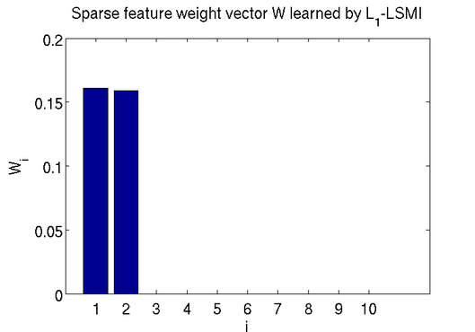

Title: $\ell_1$-LSMI
Slug: l1lsmi

Let $m$ be the number features.
$\ell_1$-LSMI attempts to find an $m$-dimensional sparse weight vector which maximizes
the squared-loss mutual information (SMI) between input variable $X$ and the output $Y$.

$$
\begin{aligned}
& \underset{\boldsymbol{w} \in \mathbb{R}^m}{\text{maximize}} & & \widehat{I}_s(\text{diag}(\boldsymbol{w})\boldsymbol{X}, \boldsymbol{Y}) \\
& \text{subject to} & & \boldsymbol{1}^T\boldsymbol{w} \leq z  \\
& & & \boldsymbol{w} \geq \boldsymbol{0},
\end{aligned}
$$

where $\widehat{I}_s$ is [Least-Squares Mutual Information (LSMI)](http://www.ms.k.u-tokyo.ac.jp/software.html#LSMI)
, an estimator of SMI. $z>0$ is the radius of the $\ell_1$-ball which controls the sparseness of $\boldsymbol{w}$.
Features are selected according to the non-zero coefficients of
the learned $\widehat{\boldsymbol{w}}$. 

## Download

Matlab implementation of $\ell_1$-LSMI: <a href="files/l1lsmi.zip">l1lsmi.zip</a>. 
A full source tree can also be obtained from [this github page](https://github.com/wittawatj/l1lsmi).
See the Github page for a usage demo. Alternatively, you may

* Run startup.m to include all files into the search path.</li>
* See and run demo_pglsmi.m.</li>

## Examples

Define a toy dataset having <i>xor</i> relationship as follows:

* $Y = \text{xor}(X_1,X_2)$, where $\text{xor}(X_1,X_2)$
          denotes the XOR function for $X_1$ and $X_2$.</li>
* $X_1,\ldots,X_5 \sim \text{Bernoulli(0.5)}$ where $\mathrm{Bernoulli}(p)$ denotes the Bernoulli distribution
                  taking value 1 with probability $p$. </li>
* $X_6,\ldots,X_{10} \sim \text{Bernoulli(0.75)}$. </li>
  
This is a binary classification problem with 2 true ($X_1$ and $X_2$) and 8 distracting features.
By setting the desired number of features ($k$) to 2, $\ell_1$-LSMI automatically finds the value
of $z$ such that two features can be obtained. The learned sparse weight vector $W$ is shown as follows.

It can be seen that $\ell_1$-LSMI is able to correctly identify the dependent features $X_1$ and $X_2$.
The rest has 0 weights. Since only weights of $X_1$ and $X_2$ are non-zeros, 
only $X_1$ and $X_2$ need to be kept.

## References
* Jitkrittum, W., Hachiya, H., Sugiyama, M.  
	Feature Selection via $\ell_1$-Penalized Squared-Loss Mutual Information  
	IEICE Transaction, vol.96-D, no.7, pp.1513-1524, 2013.

* Jitkrittum, W., Hachiya, H., Sugiyama, M.  
	Feature Selection via $\ell_1$-Penalized Squared-Loss Mutual Information  
	<i><a href="http://arxiv.org/abs/1210.1960">arXiv:1210.1960</a></i>

* Suzuki, T., Sugiyama, M., Kanamori, T., &amp; Sese, J.    
		Mutual information estimation reveals global associations
		between stimuli and biological processes.     
		<I><A HREF="http://www.biomedcentral.com/bmcbioinformatics/">BMC Bioinformatics</A></I>,
		vol.10, no.1, pp.S52, 2009.    
		[ <A HREF="http://sugiyama-www.cs.titech.ac.jp/~sugi/2009/LSMI-Bio.pdf">paper</A> ]
* 	Kanamori, T., Hido, S., &amp; Sugiyama, M.     
		A least-squares approach to direct importance estimation.    
		<I><A HREF="http://www.jmlr.org">Journal of Machine Learning Research</A></I>,
		vol.10 (Jul.), pp.1391-1445, 2009.    
		[ <A HREF="http://sugiyama-www.cs.titech.ac.jp/~sugi/2009/LSIF.pdf">paper</A> ]
	
